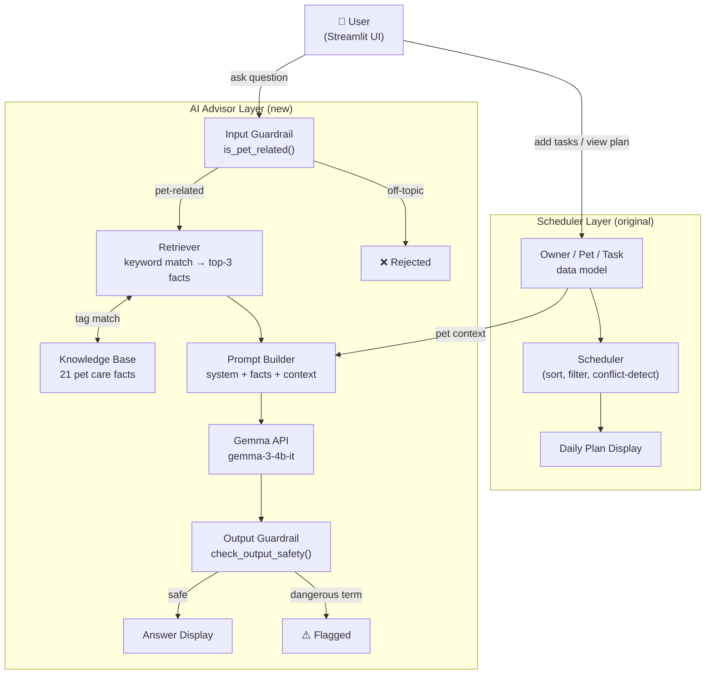

# PawPal+ — AI-Powered Pet Care Planner

## Original Project (Modules 1–3)

**PawPal+** was originally built in Modules 1–3 as a rule-based pet scheduling tool. The original system let a pet owner enter basic owner and pet information, add care tasks (walk, feed, medicate, groom) with times and priorities, and generate a daily schedule sorted by time. It also detected scheduling conflicts when two tasks shared the same time slot and auto-rescheduled recurring daily and weekly tasks after completion. It had no AI component — all logic was hand-coded Python.

---

## Title and Summary

**PawPal+ AI Edition** extends the original scheduler with a RAG-powered AI Care Advisor. A pet owner can now type a natural-language question ("How often should I brush my Ragdoll?") and receive a grounded, fact-backed answer from the Gemini API. The advisor retrieves the most relevant facts from a built-in pet care knowledge base before calling the model, keeping answers accurate and token usage minimal. Two guardrails — an input filter that rejects off-topic questions and an output scanner that flags dangerous terms — prevent the system from producing harmful advice.

---

## Architecture Overview

The system has two independent layers that share the same `Owner`/`Pet` data:

1. **Scheduler layer** (original) — Python classes manage tasks; Streamlit displays the daily plan.
2. **AI Advisor layer** (new) — a four-step RAG pipeline answers pet care questions.



**Data flow for a question:** User types question → input guardrail checks pet-relevance (no API call) → retriever scores all 21 facts by keyword overlap, picks top 3 → prompt builder combines system instructions, facts, and pet context → Gemini generates a 2–3 sentence answer → output guardrail scans for dangerous terms → result displayed in the UI.

**Human / testing involvement:** `eval_advisor.py` runs four automated test cases. Tests 3 and 4 verify the guardrails without any API call; tests 1 and 2 call Gemini live and check the returned status.

---

## Setup Instructions

### 1. Clone or download the project

```bash
cd ai110-module2show-pawpal-starter
```

### 2. Create and activate a virtual environment

```bash
python -m venv .venv
source .venv/bin/activate        # Windows: .venv\Scripts\activate
```

### 3. Install dependencies

```bash
pip install -r requirements.txt
```

### 4. Add your Gemini API key

```bash
cp .env.example .env
```

Open `.env` and replace `your_gemini_api_key_here` with your actual key.
Get a free key at **https://aistudio.google.com/app/apikey**.

> The scheduler and UI work without the key. Only the AI Advisor section requires it.

### 5. Run the Streamlit app

```bash
streamlit run app.py
```

### 6. (Optional) Run the CLI demo

```bash
python main.py
```

### 7. (Optional) Run tests

```bash
# Unit tests
pytest tests/

# Guardrail + AI evaluation script
python eval_advisor.py
```

---
## Video Walkthrough
 
<video src="E1FF99AD-4699-4011-B172-D0AA46FB9E1A.mov" width="100%"></video>
---
## Sample Interactions

### Interaction 1 — Valid pet care question with pet context

**Input:**
```
Question  : How often should I walk my Golden Retriever?
Pet context: Buddy, Dog, Golden Retriever, age 3
```

**Retrieved facts used:**
- Adult dogs need 30–120 minutes of exercise per day; high-energy breeds (Huskies, Border Collies) need more than low-energy breeds (Bulldogs, Basset Hounds).
- Golden Retrievers are prone to hip dysplasia; keep walks moderate and avoid high-impact jumping, especially as they age past 7.
- Fresh water must always be available for dogs and cats; change it daily and clean the bowl weekly.

**AI Answer:**
> Buddy should get at least 30–60 minutes of walking per day, split across two walks if possible. As a Golden Retriever, he is prone to hip dysplasia, so keep the pace moderate and avoid high-impact activities like jumping. Make sure fresh water is available before and after each walk.

---

### Interaction 2 — Valid cat grooming question

**Input:**
```
Question  : How often should I brush my Ragdoll cat?
Pet context: Mochi, Cat, Ragdoll, age 2
```

**Retrieved facts used:**
- Long-haired cats such as Ragdolls and Persians need brushing 3–4 times per week to prevent matting and reduce hairballs.
- Short-haired cats are mostly self-grooming but benefit from weekly brushing to reduce shedding and hairballs.
- Stress signs in pets include hiding, aggression, loss of appetite, and excessive grooming...

**AI Answer:**
> Mochi should be brushed 3–4 times per week to prevent matting and reduce hairballs, since Ragdolls have long, silky coats that tangle easily. Use a wide-tooth comb and a slicker brush, and make grooming a calm routine from a young age. If you notice excessive self-grooming beyond normal, that can be a sign of stress — consult your vet if it persists.

---

### Interaction 3 — Off-topic query (input guardrail fires)

**Input:**
```
Question: What is the best restaurant in Chicago?
```

**Output:**
> This question doesn't appear to be pet-related. PawPal+ only answers pet care questions.

*The Gemini API is never called. No tokens are spent.*

---

### Interaction 4 — Dangerous-term output guardrail (eval_advisor.py demo)

**Mocked model response:**
```
You can give your dog ibuprofen for pain relief.
```

**Guardrail output:**
> This response was flagged because it mentions 'ibuprofen', which can be harmful to pets. Please consult your vet before acting on any medication advice.

---

## Design Decisions

| Decision | Rationale |
|---|---|
| **Keyword retrieval instead of embeddings** | Embeddings require an extra API call or a local model. Simple keyword-tag overlap is fast, free, costs zero tokens, and is sufficient for a small, curated knowledge base of 21 facts. |
| **Gemma 3 4B IT** | A lightweight, instruction-tuned open model available through the Google AI API. Responses are short (2–3 sentences forced by the prompt), so cost per query is minimal. |
| **Prompt limited to 3 retrieved facts** | Sending all 21 facts every time would waste tokens and increase latency. Top-3 retrieval keeps the context window small while providing relevant grounding. |
| **Two-layer guardrail (input + output)** | Input filtering stops off-topic calls before any tokens are spent. Output scanning catches the edge case where the model generates dangerous advice despite a safe prompt. |
| **`.env` for API key** | Never hardcode credentials. The `.gitignore` excludes `.env`; `.env.example` shows collaborators what to fill in. |
| **Graceful degradation** | If `GEMINI_API_KEY` is missing, all UI sections except the AI Advisor still work. The advisor shows a clear error message instead of crashing. |

**Main trade-off:** Keyword retrieval can miss relevant facts when the user's phrasing doesn't match the tags. For example, asking "what should Mochi eat?" might not match the feeding tags as reliably as "how often should I feed my cat?" A vector-embedding retriever would handle paraphrase better, but that complexity is not justified for this scope.

---

## Testing Summary

### Automated unit tests (`pytest tests/`)

| Test | What it checks | Result |
|---|---|---|
| `test_task_completion` | `complete_task()` sets `completed = True` | Pass |
| `test_task_addition` | Adding tasks increments the pet's task count | Pass |

### Guardrail evaluation (`python eval_advisor.py`)

| Test | What it checks | API needed |
|---|---|---|
| Test 1: Dog exercise query | Live Gemini call returns `status="ok"` | Yes |
| Test 2: Cat grooming query | Live Gemini call returns `status="ok"` | Yes |
| Test 3: Off-topic guardrail | `is_pet_related()` returns `False` → query rejected | No |
| Test 4: Output safety guardrail | `check_output_safety()` flags `"ibuprofen"` in mock response | No |

Tests 3 and 4 pass without any API key and demonstrate that both guardrails work correctly. Tests 1 and 2 are skipped gracefully when no API key is present.

**What worked:** Keyword retrieval consistently surfaces the right facts for direct, species- or breed-specific questions. Both guardrails fire correctly on every test case.

**What didn't:** The input guardrail uses a fixed keyword set. A question like "Is it safe for Buddy after eating?" would pass the filter but not match any specific facts, resulting in a generic answer. Expanding the keyword list or using a classifier would fix this.

**Lesson learned:** Separating retrieval from generation makes the system easier to debug. When an answer is wrong, you can inspect the retrieved facts first to decide whether the problem is retrieval (wrong facts surfaced) or generation (facts correct, model misused them).

---

## Reflection

### How AI was used during development

Claude Code was used as a collaborative development partner throughout this extension. During the design phase, I described the RAG pipeline I wanted and asked for help structuring it into clean, testable functions. During implementation, I asked for specific help on: building the keyword-scoring retriever as a sorted lambda, structuring the `ask_advisor()` return dict consistently across all status branches, and wiring the form state in Streamlit so the question clears correctly after submission.

The most useful prompts were method-specific and included the expected input/output: *"Write a `retrieve(query, top_k=3)` function that scores each fact by the number of its tags that appear in the query and returns the top_k texts."* Broad prompts produced too many changes at once.

### One helpful AI suggestion

When I first wrote the prompt builder, I had the system prompt, facts, and question concatenated with no structure. Claude suggested adding explicit labeled sections (`"Retrieved facts:\n..."`, `"Question: ..."`) so the model could distinguish grounding context from the actual query. This produced more focused answers and reduced hallucination, since the model could clearly see what information it was supposed to draw from.

### One flawed AI suggestion

Claude initially suggested using `st.session_state` to cache the full conversation history and send it with every Gemini call, making the advisor a multi-turn chatbot. This would have multiplied token usage with every question. For a pet care assistant where each question is typically independent, single-turn calls are both cheaper and simpler. I rejected the suggestion and kept the stateless design.

### System limitations

1. **Knowledge base is static.** Facts are hardcoded in `knowledge_base.py`. Adding new pets, breeds, or medications requires editing the file. A real system would store facts in a database and allow the owner to add custom facts.
2. **Keyword retrieval does not understand paraphrase.** "What should Buddy eat?" and "feeding schedule for my dog" both relate to feeding but may not match the same tags. Vector embeddings would fix this.
3. **No conversation memory.** Each question is answered independently. The advisor cannot handle follow-up questions like "what about for a senior dog?" without restating all context.

### Future improvements

- Replace keyword retrieval with sentence-embedding similarity (e.g., using `sentence-transformers` locally) for paraphrase-robust retrieval.
- Allow owners to add custom facts (breed-specific notes from their vet) stored in a local JSON file.
- Add a confidence score to the answer: if the best-matching fact has zero overlap with the query, warn the user that the answer may not be grounded.
- Extend the output guardrail with a secondary Gemini call that scores the answer's safety before displaying it (multi-model agreement pattern).
