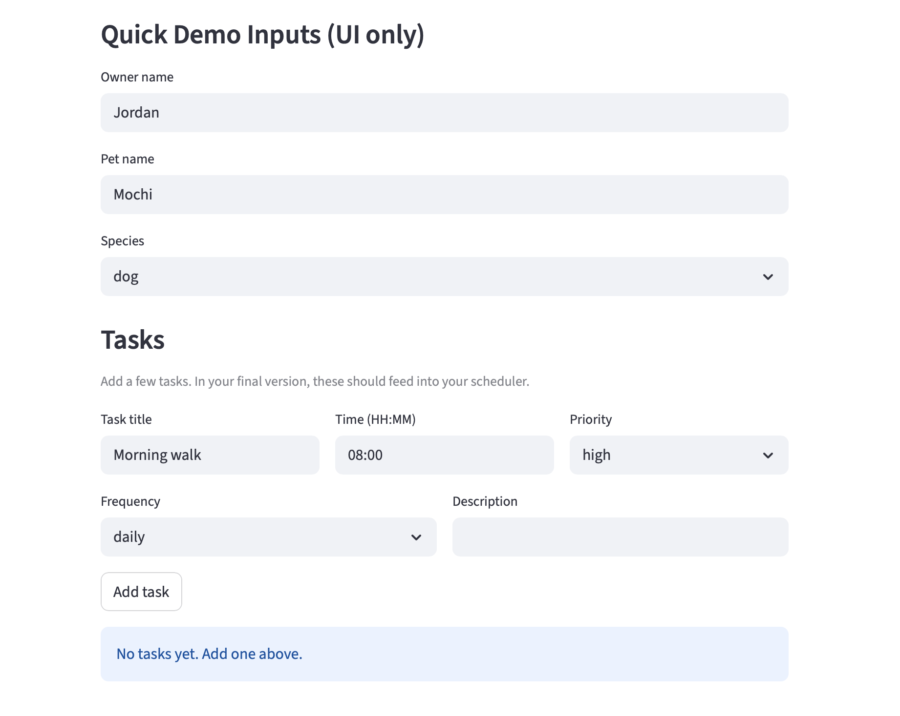

# PawPal+ (Module 2 Project)

You are building **PawPal+**, a Streamlit app that helps a pet owner plan care tasks for their pet.

## Scenario

A busy pet owner needs help staying consistent with pet care. They want an assistant that can:

- Track pet care tasks (walks, feeding, meds, enrichment, grooming, etc.)
- Consider constraints (time available, priority, owner preferences)
- Produce a daily plan and explain why it chose that plan

Your job is to design the system first (UML), then implement the logic in Python, then connect it to the Streamlit UI.

## What you will build

Your final app should:

- Let a user enter basic owner + pet info
- Let a user add/edit tasks (duration + priority at minimum)
- Generate a daily schedule/plan based on constraints and priorities
- Display the plan clearly (and ideally explain the reasoning)
- Include tests for the most important scheduling behaviors

## Getting started

### Setup

```bash
python -m venv .venv
source .venv/bin/activate  # Windows: .venv\Scripts\activate
pip install -r requirements.txt
```

## Features

### Data model
- **Owner & Pet management** — an `Owner` holds any number of `Pet` objects; each pet owns its own task list. `get_pet_by_name()` provides fast lookup without scanning every pet.
- **Flexible task scheduling** — every `Task` carries a `Schedule` with a start date, end date (optional), frequency, and time. Tasks with no schedule are still valid and appear in unscheduled views.

### Scheduling algorithms
- **Sorting by time** — `sort_by_time()` orders any list of tasks chronologically by their `HH:MM` start time using a lambda key. Tasks without a schedule are pushed to the end with a `"99:99"` sentinel so the sort never raises.
- **Priority ordering** — `get_all_tasks()` sorts across all pets by priority level (`high → medium → low`) so the most critical care actions surface first.
- **Date-range filtering** — `get_tasks_for_date()` checks each task's `start_date`, `end_date`, and `frequency` to return only tasks that are active on a given day, correctly handling `daily`, `weekly`, and `once` recurrence patterns.
- **Flexible filtering** — `filter_tasks()` accepts an optional completion status (`True`/`False`) and/or pet name; any combination works, and omitting a parameter skips that filter entirely.

### Recurrence & completion
- **Daily recurrence** — when a `daily` task is marked complete via `complete_task()`, a new `Task` instance is automatically created with `start_date + 1 day` and added back to the pet's task list.
- **Weekly recurrence** — same logic for `weekly` tasks, advancing the start date by 7 days.
- **One-time tasks** — `once` tasks are marked complete with no next occurrence created. Tasks are also not rescheduled if the new date would exceed the schedule's `end_date`.

### Conflict warnings
- **Conflict detection** — `get_conflicts()` groups all tasks active on a given date by their `HH:MM` time slot. Any slot with two or more tasks (same pet or different pets) produces a human-readable warning string. The method never raises — it returns an empty list when no conflicts exist.

### Streamlit UI
- **Live schedule view** — today's tasks are fetched, sorted by time, and rendered as priority-coloured cards (`st.error` for high, `st.warning` for medium, `st.info` for low, `st.success` for completed).
- **Conflict banner** — conflicts are grouped in a bordered container with `st.error` alerts so they are immediately visible at the top of the schedule.
- **Interactive filtering** — dropdowns let the user filter the task table by pet name and completion status in real time; results are rendered in a colour-coded `st.dataframe`.
- **Summary metrics** — `st.metric` tiles show total tasks today, pending count, and completed count at a glance.

## Smarter Scheduling

Four features were added to the `Scheduler` class to make the daily plan more useful:

| Feature | Method | What it does |
|---|---|---|
| **Time sorting** | `sort_by_time(tasks)` | Orders any task list chronologically by `HH:MM` start time. Tasks without a schedule are placed at the end. |
| **Flexible filtering** | `filter_tasks(completed, pet_name)` | Returns tasks matching any combination of completion status and/or pet name. Both parameters are optional — omit either to skip that filter. |
| **Auto-rescheduling** | `complete_task(task)` | Marks a task done. For `daily` tasks a new instance is created for the next day; for `weekly` tasks, seven days ahead. `once` tasks are not rescheduled. Returns the new `Task` or `None`. |
| **Conflict detection** | `get_conflicts(target)` | Scans all tasks active on a given date and returns a list of human-readable warning strings for any time slot with two or more overlapping tasks (same or different pets). Never raises — returns an empty list when there are no conflicts. |


### Demo


### Suggested workflow

1. Read the scenario carefully and identify requirements and edge cases.
2. Draft a UML diagram (classes, attributes, methods, relationships).
3. Convert UML into Python class stubs (no logic yet).
4. Implement scheduling logic in small increments.
5. Add tests to verify key behaviors.
6. Connect your logic to the Streamlit UI in `app.py`.
7. Refine UML so it matches what you actually built.
