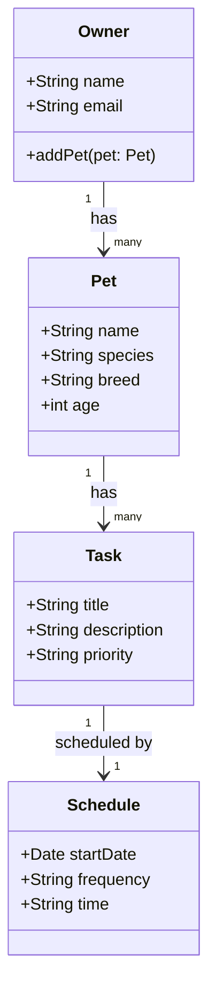

# PawPal+ Project Reflection

## 1. System Design

#### Actions
- Entering pet info
- Add tasks
- Add a schedule for tasks

**a. Initial design**

- Briefly describe your initial UML design.

The initial design uses four classes: `Owner`, `Pet`, `Task`, and `Schedule`. An Owner holds a list of Pets, each Pet holds a list of Tasks, and each Task optionally links to one Schedule. This chain reflects the three core actions in the app, entering pet info, adding tasks, and scheduling those tasks.

- What classes did you include, and what responsibilities did you assign to each?

| Class | Responsibility |
|-------|----------------|
| `Owner` | Represents the app user; manages their collection of pets |
| `Pet` | Stores pet info (name, species, breed, age); owns its tasks |
| `Task` | Represents a single care action (e.g. feed, walk); holds title, description, and priority |
| `Schedule` | Holds when and how often a task runs (start date, frequency, time) |

**b. Design changes**

- Did your design change during implementation?

Yes, three changes were made after reviewing the initial skeleton.

- If yes, describe at least one change and why you made it.

**Change 1 — Added `end_date` to `Schedule`**
The initial `Schedule` only had `start_date`, `frequency`, and `time`. Without an `end_date`, there was no way to stop a recurring task. For example, a medication task that runs daily for two weeks would have no defined endpoint. Adding `end_date` as an optional field (defaulting to `None` for open-ended tasks) fixes this without overcomplicating the class.

**Change 2 — Added `pet_name` to `Task`**
The initial design had `Task` floating without any reference back to the `Pet` it belonged to. This would make it impossible to display or filter tasks by pet without scanning every pet's task list. Adding `pet_name` gives each task a direct link to its owner.

**Change 3 — Added `get_pet_by_name()` to `Owner`**
Without this method, the only way to access a specific pet was to loop through `owner.pets` every time. Since tasks and schedules are always tied to a specific pet, this lookup would be needed repeatedly. Adding the method prevents that bottleneck from spreading through the rest of the code.

---

## 2. Scheduling Logic and Tradeoffs

**a. Constraints and priorities**

- What constraints does your scheduler consider (for example: time, priority, preferences)?

The scheduler considers three constraints. First, **time** — each task's `Schedule.time` (`HH:MM`) determines when it appears in the day's agenda, and `sort_by_time()` orders tasks chronologically. Second, **date range** — `get_tasks_for_date()` checks `start_date` and `end_date` so tasks only appear within their active window, and `frequency` (`daily`, `weekly`, `once`) controls how often they recur. Third, **priority** — `get_all_tasks()` sorts by priority level (`high → medium → low`) so the most important tasks surface first when time is not the primary sort key.

- How did you decide which constraints mattered most?

Time came first because a pet care app is fundamentally a daily checklist — an owner needs to know what to do and in what order. Date range came second because without it, a one-time medication or a short course of treatment would appear forever. Priority came last because it is a secondary sort used when scanning all tasks across pets, not a hard scheduling rule; two high-priority tasks can still run at the same time, and it is up to the owner to resolve that.

**b. Tradeoffs**

- Describe one tradeoff your scheduler makes.

The scheduler's `get_conflicts()` method flags a conflict only when two tasks share the exact same `HH:MM` start time. It does not consider how long each task takes, so a 30-minute walk starting at `07:00` and a vet check-in starting at `07:20` would not be flagged even though they overlap in real life. This is a deliberate simplification — the `Task` and `Schedule` classes store no duration field, so there is no data to support true interval-overlap logic (`start_A < end_B and start_B < end_A`).

- Why is that tradeoff reasonable for this scenario?

Pet care tasks (feed, medicate, walk) are short and discrete. Exact-match conflict detection catches the most critical mistake — two tasks booked at the identical start time — without over-engineering the scheduler for a use case the data model does not yet support. Adding duration would require changing the data model and deciding how to handle tasks with unknown or variable lengths, which is complexity not justified at this scope.

---

## 3. AI Collaboration

**a. How you used AI**

- How did you use AI tools during this project (for example: design brainstorming, debugging, refactoring)?

- What kinds of prompts or questions were most helpful?

**b. Judgment and verification**

- Describe one moment where you did not accept an AI suggestion as-is.

- How did you evaluate or verify what the AI suggested?

---

## 4. Testing and Verification

**a. What you tested**

- What behaviors did you test?

- Why were these tests important?

**b. Confidence**

- How confident are you that your scheduler works correctly?

- What edge cases would you test next if you had more time?

---

## 5. Reflection

**a. What went well**

- What part of this project are you most satisfied with?

**b. What you would improve**

- If you had another iteration, what would you improve or redesign?

**c. Key takeaway**

- What is one important thing you learned about designing systems or working with AI on this project?
