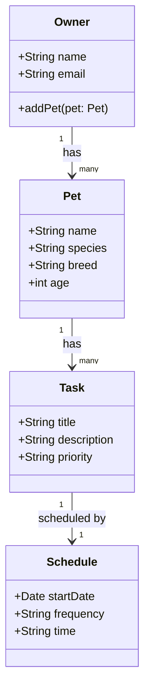
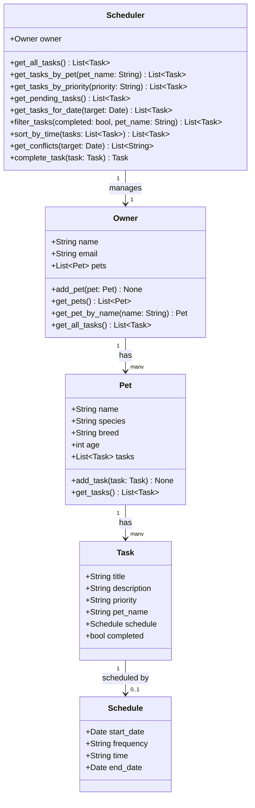

# PawPal+ Project Reflection

## 1. System Design

#### Actions
- Entering pet info
- Add tasks
- Add a schedule for tasks

**a. Initial design**

- Briefly describe your initial UML design.

The initial design uses four classes: `Owner`, `Pet`, `Task`, and `Schedule`. An Owner holds a list of Pets, each Pet holds a list of Tasks, and each Task optionally links to one Schedule. This chain reflects the three core actions in the app, entering pet info, adding tasks, and scheduling those tasks.

- What classes did you include, and what responsibilities did you assign to each?

| Class | Responsibility |
|-------|----------------|
| `Owner` | Represents the app user; manages their collection of pets |
| `Pet` | Stores pet info (name, species, breed, age); owns its tasks |
| `Task` | Represents a single care action (e.g. feed, walk); holds title, description, and priority |
| `Schedule` | Holds when and how often a task runs (start date, frequency, time) |

**a. Final design (updated to match implemented code)**

**b. Design changes**

- Did your design change during implementation?

Yes, three changes were made after reviewing the initial skeleton.

- If yes, describe at least one change and why you made it.

**Change 1 — Added `end_date` to `Schedule`**
The initial `Schedule` only had `start_date`, `frequency`, and `time`. Without an `end_date`, there was no way to stop a recurring task. For example, a medication task that runs daily for two weeks would have no defined endpoint. Adding `end_date` as an optional field (defaulting to `None` for open-ended tasks) fixes this without overcomplicating the class.

**Change 2 — Added `pet_name` to `Task`**
The initial design had `Task` floating without any reference back to the `Pet` it belonged to. This would make it impossible to display or filter tasks by pet without scanning every pet's task list. Adding `pet_name` gives each task a direct link to its owner.

**Change 3 — Added `get_pet_by_name()` to `Owner`**
Without this method, the only way to access a specific pet was to loop through `owner.pets` every time. Since tasks and schedules are always tied to a specific pet, this lookup would be needed repeatedly. Adding the method prevents that bottleneck from spreading through the rest of the code.

---

## 2. Scheduling Logic and Tradeoffs

**a. Constraints and priorities**

- What constraints does your scheduler consider (for example: time, priority, preferences)?

The scheduler considers three constraints. First, **time** — each task's `Schedule.time` (`HH:MM`) determines when it appears in the day's agenda, and `sort_by_time()` orders tasks chronologically. Second, **date range** — `get_tasks_for_date()` checks `start_date` and `end_date` so tasks only appear within their active window, and `frequency` (`daily`, `weekly`, `once`) controls how often they recur. Third, **priority** — `get_all_tasks()` sorts by priority level (`high → medium → low`) so the most important tasks surface first when time is not the primary sort key.

- How did you decide which constraints mattered most?

Time came first because a pet care app is fundamentally a daily checklist — an owner needs to know what to do and in what order. Date range came second because without it, a one-time medication or a short course of treatment would appear forever. Priority came last because it is a secondary sort used when scanning all tasks across pets, not a hard scheduling rule; two high-priority tasks can still run at the same time, and it is up to the owner to resolve that.

**b. Tradeoffs**

- Describe one tradeoff your scheduler makes.

The scheduler's `get_conflicts()` method flags a conflict only when two tasks share the exact same `HH:MM` start time. It does not consider how long each task takes, so a 30-minute walk starting at `07:00` and a vet check-in starting at `07:20` would not be flagged even though they overlap in real life. This is a deliberate simplification — the `Task` and `Schedule` classes store no duration field, so there is no data to support true interval-overlap logic (`start_A < end_B and start_B < end_A`).

- Why is that tradeoff reasonable for this scenario?

Pet care tasks (feed, medicate, walk) are short and discrete. Exact-match conflict detection catches the most critical mistake — two tasks booked at the identical start time — without over-engineering the scheduler for a use case the data model does not yet support. Adding duration would require changing the data model and deciding how to handle tasks with unknown or variable lengths, which is complexity not justified at this scope.

---

## 3. AI Collaboration

**a. How you used AI**

- How did you use AI tools during this project (for example: design brainstorming, debugging, refactoring)?

AI was used at every stage of the project. During design, I described the app scenario and asked Claude to help identify which classes were needed and what responsibilities each should carry. During implementation, I asked for specific method bodies — for example, how to write `sort_by_time()` using a lambda, and how to structure `complete_task()` so it auto-creates the next occurrence without mutating the original task. During the UI phase, I asked Claude to wire the Scheduler methods into the Streamlit buttons and explain which `st.*` components to use for priority-colour coding.

- What kinds of prompts or questions were most helpful?

The most useful prompts were concrete and scoped to one method at a time: *"Write a `filter_tasks()` method that accepts optional `completed` and `pet_name` parameters and returns matching tasks from `owner.get_all_tasks()`."* Broad prompts like *"improve the app"* produced too many changes at once and were harder to review. Asking *"why"* questions was also valuable — for example, *"why does `'99:99'` work as a sentinel for sorting?"* — because the explanation helped me understand the logic rather than just copy it.

**b. Judgment and verification**

- Describe one moment where you did not accept an AI suggestion as-is.

When AI first suggested the full `app.py` rewrite, it deleted the original starter content — the Scenario expander, the "What you need to build" section, and the existing task table — replacing everything with new code. That was not what I asked for. I rejected the change and asked for targeted edits only, keeping the existing structure intact.

- How did you evaluate or verify what the AI suggested?

I ran the app after each change using `python3 main.py` or `streamlit run app.py` and checked the terminal output against what I expected. For the scheduler methods, I verified correctness by reading the printed task lists and confirming that sort order, filter results, and next-occurrence dates matched the logic described in the docstrings. For the UML diagram, I cross-referenced every class, attribute, and method against the final `pawpal_system.py` file line by line before accepting the update.

---

## 4. Testing and Verification

**a. What you tested**

- What behaviors did you test?

The following behaviors were tested by running `main.py` and inspecting printed output:

1. **Sorting** — tasks were intentionally added out of chronological order (Evening Walk at 18:30 first, Morning Walk at 07:00 last) and `sort_by_time()` was verified to produce the correct `07:00 → 08:00 → 09:00 → ...` order.
2. **Filtering** — `filter_tasks(completed=False)`, `filter_tasks(completed=True)`, `filter_tasks(pet_name="Buddy")`, and the combined `filter_tasks(completed=False, pet_name="Mochi")` were each tested and the returned lists were checked against the known task data.
3. **Auto-rescheduling** — `complete_task()` was called on a `daily` task, a `weekly` task, and a `once` task. The next `start_date` was printed and confirmed to be +1 day, +7 days, and `None` respectively.
4. **Conflict detection** — two deliberate time collisions were set up (same pet at `07:00`, different pets at `09:00`) and `get_conflicts()` was confirmed to return exactly two warning strings.

- Why were these tests important?

Each test targeted a different method with its own edge-case logic. Without verifying sort order with out-of-order input, it would not be clear whether the lambda was working correctly or whether the tasks happened to already be in order. Without testing the `once` case for `complete_task()`, the method could silently return a wrong result. Running all four tests together also confirmed the methods compose correctly — for example, `filter_tasks()` followed by `sort_by_time()` produced a clean sorted-and-filtered output without side effects.

**b. Confidence**

- How confident are you that your scheduler works correctly?

Confident for the scenarios tested. All four core behaviors — sorting, filtering, auto-rescheduling, and conflict detection — produce correct output on the test data in `main.py`. The methods handle the most important edge cases: tasks without a schedule (sentinel `"99:99"`), `once` tasks not rescheduling, and conflicts across both same-pet and cross-pet cases.

- What edge cases would you test next if you had more time?

1. **`end_date` boundary on auto-reschedule** — confirm that `complete_task()` returns `None` when the next occurrence would fall exactly on or after the `end_date`.
2. **Empty pet list** — verify `get_all_tasks()` and `get_conflicts()` return empty lists rather than raising when an owner has no pets.
3. **Same-time tasks on different dates** — confirm `get_conflicts()` does not flag two tasks at `08:00` if one starts today and the other starts next week.
4. **`filter_tasks()` with no matching results** — confirm it returns `[]` cleanly rather than `None`.
5. **`sort_by_time()` with a mix of scheduled and unscheduled tasks** — confirm unscheduled tasks always land at the end regardless of how many scheduled tasks precede them.

---

## 5. Reflection

**a. What went well**

- What part of this project are you most satisfied with?

The auto-rescheduling logic in `complete_task()` is the part I am most satisfied with. It is a small method but it does something genuinely useful: marking a task done does not just flip a boolean, it creates the next real occurrence and adds it back to the pet's task list automatically. The design decision to return the new `Task` (or `None`) rather than void also made it easy to display a confirmation message in the UI — *"Next occurrence: 2026-03-31"* — without any extra lookup.

**b. What you would improve**

- If you had another iteration, what would you improve or redesign?

I would add a `duration_minutes` field to `Task` and upgrade `get_conflicts()` to use true interval-overlap detection (`start_A < end_B and start_B < end_A`) instead of exact time matching. This was the main tradeoff accepted during this iteration, and it is the most realistic limitation for a real pet care app — a 45-minute walk and a vet appointment 20 minutes later genuinely conflict, but the current scheduler would not catch it. I would also move the owner/pet setup in `app.py` to a proper multi-step form with the ability to add more than one pet, rather than hardcoding a single pet at setup time.

**c. Key takeaway**

- What is one important thing you learned about designing systems or working with AI on this project?

The most important thing I learned is that AI is most useful when you already understand what you want at the method level. Prompts like *"write `filter_tasks()` with these two optional parameters"* produced correct, reviewable code on the first try. Prompts like *"make the app better"* produced large changes that were hard to evaluate and sometimes broke existing structure. This taught me that working with AI well requires the same design thinking as working without it — you still need to decompose the problem, define the interface, and know what correct output looks like before you can judge whether the suggestion is right.
